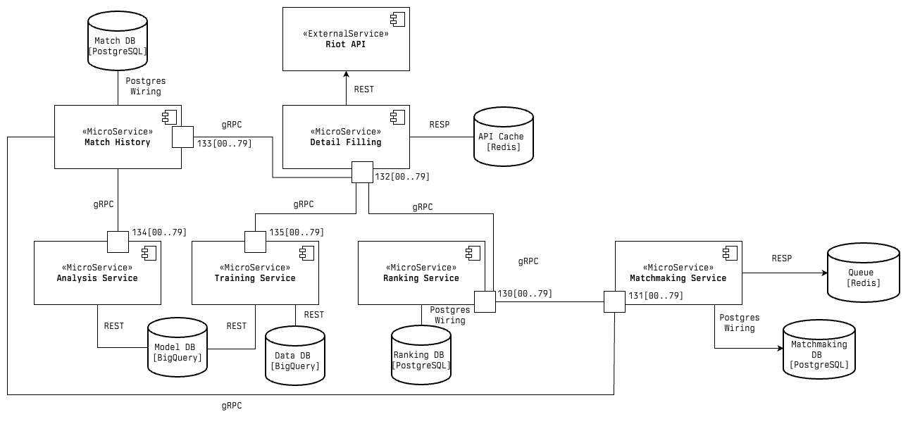

## Project Contributors

| Name               | Student ID |
|--------------------|------------|
| **Diogo Sousa**    | fc59792    |
| **Bruno Faustino** | fc59784    |
| **Rodrigo Neto**   | fc59850    |

---

## Functional Requirements

> **Detail Filling - Bruno Faustino**

* Direct contact with Riot's API to obtain match and player information;
* Automatic filtering of information to focus more on the user's needs;
* Retrieval of the full raw data to be used for data analysis;
* Retrieval of player information (rank, wins, losses, points, ...);

> **Match History - Bruno Faustino**

* Local store of simplified match information relevant to the user (winning team,
  rank, roles of each player, number of kills, deaths, assists, healing, damage,...,
  per match, per team and per player), that can be inserted either manually, with
  validation, or by providing the match's ID in Riot's API;
* Match filtering based on any criteria the user defines from the simplified
  information, including obtaining all matches of a given player, all matches where
  the player had the most kills, ...;
* Match sorting based on any criteria;
* Match retrieval with paging to avoid fetching enormous amounts of data all at once;
* Soft deletion of matches from the history;
* New match data forwarding to the data analysers;

> **Ranking - Diogo Sousa**

* Real-time calculation and updates of player skill ratings (ELO/MMR) based on match performance;
* Management of global and queue-specific leaderboards with paginated retrieval;
* Automatic player profile initialization and rank mapping via Riot account integration;
* Support for multiple ranking systems tailored to specific queues;

> **Matchmaking - Diogo Sousa**

* Management of the matchmaking queue lifecycle, including ticket creation, status tracking, and cancellation;
* "On Join" matchmaking logic to evaluate and form lobbies immediately upon player entry;
* Implementation of a Standard Queue for 10-player lobby formation;
* Implementation of a Role Queue ensuring team balance across all five roles (TOP, JUNGLE, MID, BOT, SUPP);
* Lobby lifecycle control, including match acceptance/rejection and automatic lobby dissolution on failure;
* Coordination of match states from initial discovery to finalization and result reporting;

> **Training - Rodrigo Neto**

* Ingestion of raw match data in batches with automatic deduplication and metadata storage;
* Extraction and versioning of structured feature vectors for different analytical models;
* Creation and management of curated, optimized training datasets with configurable filtering;
* Asynchronous execution of ML training jobs for draft, build, and performance models;
* Real-time monitoring of training progress and lifecycle management of active jobs;
* Maintenance of a versioned model registry with performance metrics;

> **Data Analysis - Rodrigo Neto**

* Win probability prediction for team compositions;
* Identification of team synergies, counter-matchups, and win conditions;
* Evaluation of item build effectiveness and possibly suggestion of alternatives;
* Automated benchmarking of player performance metrics against global/rank-tier averages;
* Global champion performance tracking including win, pick, and ban rate analytics;

## Application Architecture Description

> **Ranking Service - Diogo Sousa**

- **Database:** **PostgreSQL (Ranking DB)**
- **Usage:** Persists long-term player profiles, Discord/Riot account linkages, and MMR history. It stores the source of
  truth for a player's skill level and detailed win/loss/stat records across various queues.
- **Why:** Requires **ACID compliance** to ensure that MMR updates and account linking are handled atomically and
  reliably.

> **Matchmaking Service - Diogo Sousa**

- **Database:** **Redis (Queue/Locks) + PostgreSQL (Lobby Persistence)**
- **Usage:**
    - **Redis:** Manages the active matchmaking tickets and distributed locks for thread-safe lobby formation.
    - **PostgreSQL:** Stores Lobby, Match, and MatchTicket entities to track the lifecycle of a match from 'Searching'
      to 'Started' or 'Cancelled'.
- **Why:** **Redis** provides the **low latency** needed for high-frequency queue operations, while **PostgreSQL**
  ensures that lobby states and match history are **recoverable** even if a service pod restarts.

> **Detail Filling Service - Bruno Faustino**

- **Database:** **Redis (API Cache)**
- **Usage:** Caches Riot API responses for accounts and match details.
- **Why:** Essential for **performance** and **cost-efficiency**; it minimizes calls to the external Riot API,
  preventing rate-limiting/API key issues and speeding up data retrieval for other services.

> **Match History Service - Bruno Faustino**

- **Database:** **PostgreSQL (History DB)**
- **Usage:** Indexes detailed match statistics for players and teams, supporting complex filtering (e.g., 'all matches
  where player X had the most kills').
- **Why:** **Relational PostgreSQL** is ideal for complex queries, sorting, and paginated views of historical match
  data.

> **Analysis - Rodrigo Neto**

- **Database:** **BigQuery (Data DB)**
- **Usage:** Consumes match data to provide real-time and post-game insights, such as draft analysis and player
  performance metrics.
- **Why:** BigQuery allows for **efficient querying of massive datasets** without impacting the performance of the
  operational transactional databases.

> **Training Service - Rodrigo Neto**

- **Database:** **BigQuery (Model DB)**
- **Usage:** Responsible for training and storing machine learning models using historical match data.
- **Why:** Separating training from analysis ensures that **resource-intensive model training** does not compete with
  real-time insight requests.

> **Inter-Service Communication**

- The services communicate reliably through **gRPC** for high-performance internal calls (e.g., Matchmaking asking
  Ranking for a player's MMR) and **REST** for external integration and management.

### Architecture Diagram

---
